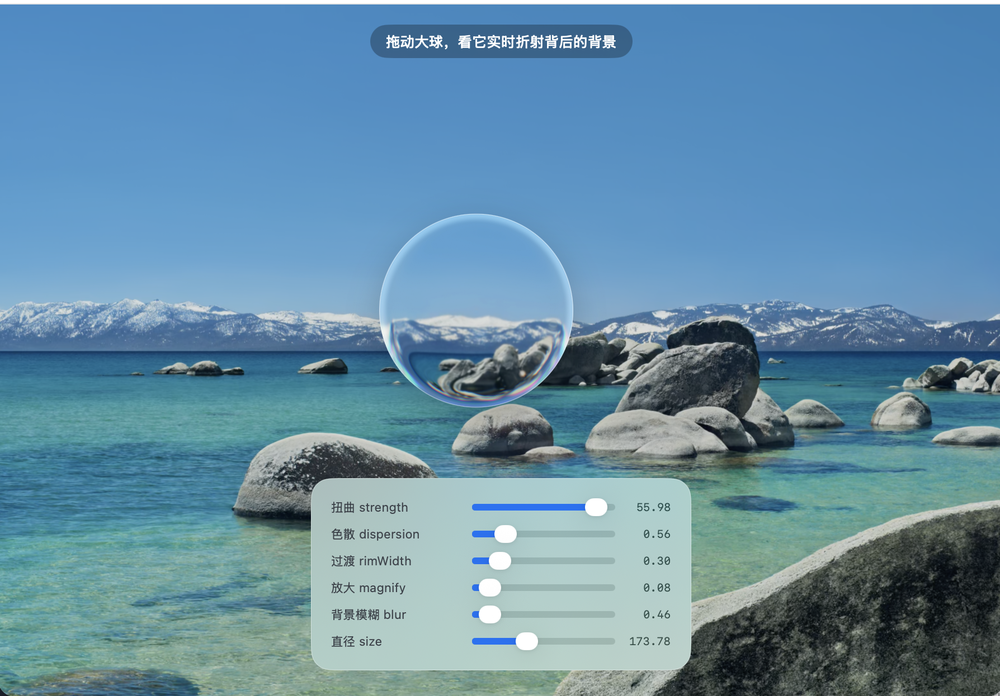

# LiquidGlassKit

**SwiftUI · macOS 26+**（核心折射逻辑同样适用于 iOS 26+，把背景图加载从 `NSImage` 换成 `UIImage` 即可）

一套自定义的 SwiftUI 液态玻璃折射效果。把背景真的采样进来，过一个 Metal 透镜 shader，做出实时折射、RGB 色散和边缘扭曲，每个参数都能单独调。

它和 Apple 的 `.glassEffect()` 解决的是不同的事：系统的液态玻璃背板几乎不可调、也没有色散；这一套自己采样背景、自己折射，所以能拖着看它实时跟随背景，也能把扭曲、色散、放大、模糊逐项调到想要的样子。



## 运行 Demo

```bash
swift run LiquidGlassDemo
```

一颗可以拖动的大玻璃球，拖到哪里都会折射它背后的背景；下方的滑杆实时调扭曲强度、色散、过渡宽度、中心放大、背景模糊和直径。

## 和 Apple .glassEffect() 的区别

|  | Apple Liquid Glass | LiquidGlassKit |
| --- | --- | --- |
| 背板 | 系统真实背板 | 自己采样的背景图 |
| 可调性 | 几乎不可调 | 每个参数都能调 |
| 色散 | 无 | 有 |
| 代价 | 零接线 | 需在根部接两根线（见下） |

## 接线要求

折射的原理是在同一坐标空间里把同一张背景重画一遍、按视图位置反向偏移，以此伪造对背板的采样。所以宿主必须在根部接好两样东西，并且坐标空间的名字必须是 `appRoot`：

```swift
import SwiftUI
import LiquidGlassKit

struct ContentView: View {
    var body: some View {
        GeometryReader { root in
            ZStack {
                // 背景，和折射层用同一个 fill，保证像素一一对齐
                LiquidGlassBackdrop.fill(size: root.size)

                LiquidGlassLens(strength: 30, dispersion: 1.2, magnify: 0.5)
                    .frame(width: 200, height: 200)
            }
            .coordinateSpace(name: "appRoot")            // 名字必须是 appRoot
            .environment(\.appBackdropSize, root.size)   // 把根尺寸传下去
        }
    }
}
```

换背景图：把图片放进 `Sources/LiquidGlassKit/Resources/`，改 `LiquidGlassBackdrop.imageResourceName` 那行字符串。设为 `nil` 会回退到内置的程序生成图案。

## 参数

| 参数 | 作用 |
| --- | --- |
| `strength` | 边缘把背景掰弯的幅度 |
| `dispersion` | RGB 色散强度，边缘的彩边 |
| `rimWidth` | 过渡层起点（0 到 1，越大过渡越宽越软）|
| `radiusScale` | 透镜半径占整圆的比例（1.0 时扭曲带正好压在边缘）|
| `backdropBlur` | 折射前对背景的模糊量，磨砂感 |
| `magnify` | 中心放大，鱼眼感 |

## 实现里踩过的坑

- 渐变里的透明段不要用 `.clear`。`.clear` 是透明的黑色，和彩色插值时会渗出黑边，应改用 `someColor.opacity(0)`。
- 不要对带透明段的渐变描边做 `.blur()`，模糊会把透明黑拉进来，出现一块跟着旋转的黑斑。
- 多个彩色光晕不要用 `.blendMode(.plusLighter)` 叠加宽描边，各颜色相加会冲向白色，看起来像一圈假的白色内发光。
- shader 之前不要 `.clipped()`，否则 shader 采样越界会变黑；让背景溢出可被采样，最后再 `clipShape`。

## 改了 shader 之后重新编译

```bash
xcrun -sdk macosx metal \
  -o Sources/LiquidGlassKit/Resources/LiquidGlassLens.metallib \
  Sources/LiquidGlassKit/Shaders/LiquidGlassLens.metal
```

## 说明

从 自用前端 项目里抽出来的一份快照，只分享这套折射效果本身。示例背景图仅供本地预览，版权归原作者，换成自己的即可。要求 macOS 26 以上（依赖 Liquid Glass 与 Metal `layerEffect`）。
